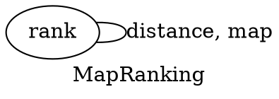
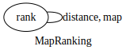
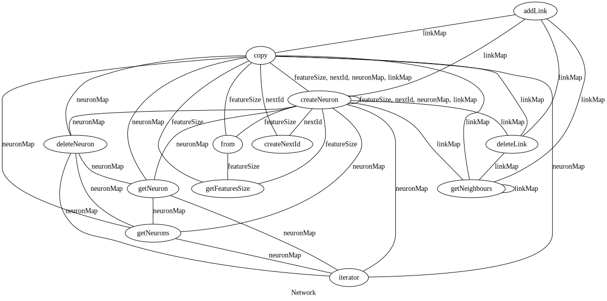
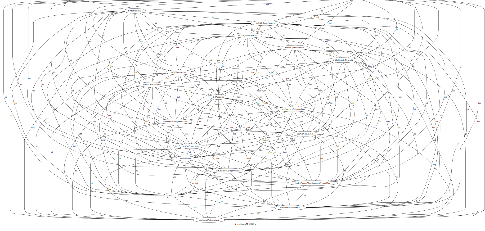

# Code of [jp-tcc](../../exercises/jp-tcc)

> TCC is defined as the ratio of directly connected pairs of node in the graph to the number or all pairs of nodes.

Check the [code](../javaparser-starter/src/main/java/fr/istic/vv/TightClassCohesionVisitor.java).
In the TCC calculus, we're ignoring static instance variable as it's.. static.

Running Main with these arguments `code/javaparser-starter/assets/tests/ code/javaparser-starter/assets/tests/reports/` will output:

```text
$ /usr/bin/env /usr/lib/jvm/java-23-jdk/bin/java @/tmp/cp_1duwpfn2f192jrwc7l44izden.argfile fr.istic.vv.Main code/javaparser-starter/assets/tests/ code/javaparser-starter/assets/tests/reports/

----- Find public methods -----
ComplexPerson
  public String getName()
  public boolean isAdult()
  public void printDetails()
  public void updateDetails(String newName, int newAge)
  public boolean canVote()
  public void showAllBelongings()
  public int countPlasticCups()
Person
  public String getName()
  public boolean isAdult()
PersonMultiVar
  public String getName()
  public int getKnownAge()
  public boolean isAdult()
big.UntestableCode
  public void complexMethod()
-- Find unaccessible fields ---
ComplexPerson
  private int age
Person
  private int age
PersonMultiVar
  private int age
big.UntestableCode
---- Cyclomatic Complexity -----
Print the CC of every methods (y/N): y
Class,Method,Complexity
ComplexPerson,canVote,1
ComplexPerson,countPlasticCups,4
ComplexPerson,getName,1
ComplexPerson,isAdult,1
ComplexPerson,printDetails,3
ComplexPerson,showAllBelongings,2
ComplexPerson,updateDetails,3
Person,getName,1
Person,isAdult,1
PersonMultiVar,getKnownAge,1
PersonMultiVar,getName,1
PersonMultiVar,isAdult,1
big.UntestableCode,complexMethod,37
----- Tight Class Cohesion -----
Print the TCC of every classes (y/N): y
Package,Class,TCC
[No Package],ComplexPerson,38.095238095238095
[No Package],Person,0.0
[No Package],PersonMultiVar,0.0
big,UntestableCode,0.0
```

and will generate in `code/javaparser-starter/assets/tests/reports/` the `cc.csv` file (the CC of each class), the `fullSourceTCCReport.csv` file (the TCC of each class) and the graph of interconnected methods of each class.

> [!NOTE] Note that will create the directory if missing

see [all the reports created](../javaparser-starter/assets/tests/reports/) for the java classes in [../javaparser-starter/assets/tests/](../javaparser-starter/assets/tests/).

Or see what could be the output on a complete and production sized project [Apache Math](commons-math-reports/).

If some methods have the same name, for example [`rank`](https://github.com/apache/commons-math/blob/56eca2b859284c8ba8e96da31df4633a1a335338/commons-math-neuralnet/src/main/java/org/apache/commons/math4/neuralnet/MapRanking.java#L79) it will [result](commons-math-reports/org.apache.commons.math4.neuralnet.MapRanking.dot) in a self connection like that:





some other example (`Network` having a TCC of 41%):
[`org.apache.commons.math4.neuralnet,Network,41.830065359477125`](commons-math-reports/fullSourceTCCReport.csv)


You can also see some [abomination](commons-math-reports/org.apache.commons.math4.neuralnet.twod.NeuronSquareMesh2DTest.dot) provoked by the use of a [random factory](https://github.com/apache/commons-math/blob/master/commons-math-neuralnet/src/test/java/org/apache/commons/math4/neuralnet/twod/NeuronSquareMesh2DTest.java#L48).


